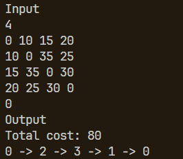
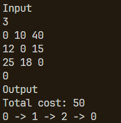

# TSP (Traveling Salesman Problem) Solver dengan Rust

[](https://www.rust-lang.org)
[](https://opensource.org/licenses/MIT)
[](https://github.com/<USERNAME>/<REPO>/actions)

## Deskripsi

Proyek ini menyediakan implementasi untuk menyelesaikan Traveling Salesman Problem (TSP) menggunakan algoritma pemrograman dinamis, secara spesifik algoritma Held-Karp. Solusi ini dirancang untuk menemukan tur Hamilton terpendek dalam sebuah graf berbobot, baik graf berarah maupun tidak berarah (dengan biaya simetris).

Algoritma Held-Karp memiliki kompleksitas waktu $O(n^2 \cdot 2^n)$ dan kompleksitas ruang $O(n \cdot 2^n)$, sehingga cocok untuk graf dengan jumlah node (kota) yang relatif kecil (biasanya hingga 20-25 node).

## Struktur Proyek

Proyek ini diorganisir sebagai sebuah **Cargo Workspace** yang terdiri dari dua *crate*:

1.  **`solver` (Pustaka/Library)**:
    * Berisi logika inti untuk algoritma TSP.
    * Mengekspos fungsi `solve_tsp_dynamic_programming` yang menerima representasi graf (matriks kedekatan) dan node awal, lalu mengembalikan `Result` yang berisi biaya minimum dan jalur tur optimal, atau sebuah `TspError` jika terjadi masalah.
    * Struktur internal:
        * `src/lib.rs`: Titik masuk API publik pustaka.
        * `src/solver.rs`: Implementasi detail dari struct `TspSolver` dan algoritma Held-Karp.

2.  **`runner` (Aplikasi Biner/Executable)**:
    * Merupakan aplikasi konsol sederhana yang menggunakan pustaka `solver`.
    * Membaca input dari pengguna (atau standar input) berupa jumlah kota, matriks biaya, dan node awal.
    * Mencetak jalur TSP optimal yang ditemukan atau pesan error.
    * Struktur internal:
        * `src/main.rs`: Fungsi `main` dan logika untuk interaksi dengan pengguna serta pemanggilan pustaka `solver`.

## Persyaratan

* **Rust Toolchain**: Pastikan Anda telah menginstal Rust dan Cargo. Anda bisa mendapatkannya dari [rustup.rs](https://rustup.rs/).

## Cara Membangun Proyek

Semua perintah Cargo harus dijalankan dari direktori root workspace (direktori yang berisi `Cargo.toml` level workspace dan subdirektori `solver` serta `runner`).

1.  **Clone Repositori (jika ada):**
    ```bash
    git clone <url_repositori_anda>
    cd <nama_direktori_workspace>
    ```

2.  **Membangun Seluruh Workspace:**
    Perintah ini akan mengompilasi pustaka `solver` dan aplikasi biner `runner`.
    ```bash
    cargo build
    ```
    Untuk build rilis yang dioptimalkan:
    ```bash
    cargo build --release
    ```
    Artefak build akan ditempatkan di direktori `target/debug/` atau `target/release/` di dalam direktori root workspace.

## Cara Menjalankan Aplikasi `runner`

Aplikasi `runner` membaca input dari standar input (`stdin`).

1.  **Menjalankan dengan `cargo run`:**
    Anda bisa menjalankan aplikasi `runner` langsung menggunakan `cargo run` dari direktori root workspace. Pastikan untuk menentukan paket `-p runner`.
    ```bash
    cargo run -p runner
    ```
    Program akan menunggu input.

2.  **Format Input:**
    Program mengharapkan input dengan format berikut, setiap baris diakhiri dengan newline:
    ```
    N
    a11 a12 ... a1N
    a21 a22 ... a2N
    ...
    aN1 aN2 ... aNN
    start_node
    ```
    * **Baris 1**: `N` (sebuah integer positif) - jumlah kota.
    * **Baris 2 hingga N+1**: Matriks biaya berukuran `N x N`. Setiap baris berisi `N` integer yang dipisahkan spasi, merepresentasikan biaya dari kota `i` ke kota `j`. Gunakan angka yang sangat besar (misalnya, `99999` atau `2147483647/2`) untuk menandakan tidak ada jalur langsung.
    * **Baris N+2**: `start_node` (sebuah integer) - node awal untuk tur (indeks berbasis 0, dari `0` hingga `N-1`).

3.  **Contoh Penggunaan dengan File Input:**
    Buat file teks, misalnya `input.txt`, dengan format di atas:
    ```
    4
    0 10 15 20
    10 0 35 25
    15 35 0 30
    20 25 30 0
    0
    ```
    Kemudian jalankan program dengan mengarahkan isi file ke standar input:
    ```bash
    cargo run -p runner < input/tc1.txt
    ```
    Atau jika Anda sudah membangun versi rilis:
    ```bash
    ./target/release/tsp_runner_executable < input.txt
    ```
    (Nama executable mungkin bervariasi tergantung konfigurasi `runner/Cargo.toml`. Jika `name` di `[[bin]]` adalah `tsp_runner_executable`, maka nama file akan seperti itu. Jika tidak ada `[[bin]]` atau `name` di `[[bin]]` sama dengan nama package `runner`, maka nama executable akan menjadi `runner`).

4.  **Output Program:**
    Program akan mencetak jalur TSP optimal yang ditemukan ke standar output (`stdout`) dalam format `[node1, node2, ..., nodeN, node1]`. Jika terjadi error (misalnya, input tidak valid, tidak ada jalur ditemukan), pesan error akan dicetak ke standar error (`stderr`).

## Screenshot Hasil
### Test Case 1


### Test Case 2

## Cara Menjalankan Tes

Pustaka `solver` dilengkapi dengan serangkaian unit test untuk memverifikasi kebenaran algoritma.

1.  **Menjalankan Semua Tes di Workspace:**
    Dari direktori root workspace:
    ```bash
    cargo test
    ```

2.  **Menjalankan Tes Hanya untuk Pustaka `solver`:**
    Dari direktori root workspace:
    ```bash
    cargo test -p solver
    ```

## Penulis

* Muhammad Fathur Rizky (13523105)

## Lisensi

Proyek ini dilisensikan di bawah [Lisensi MIT](LICENSE).
